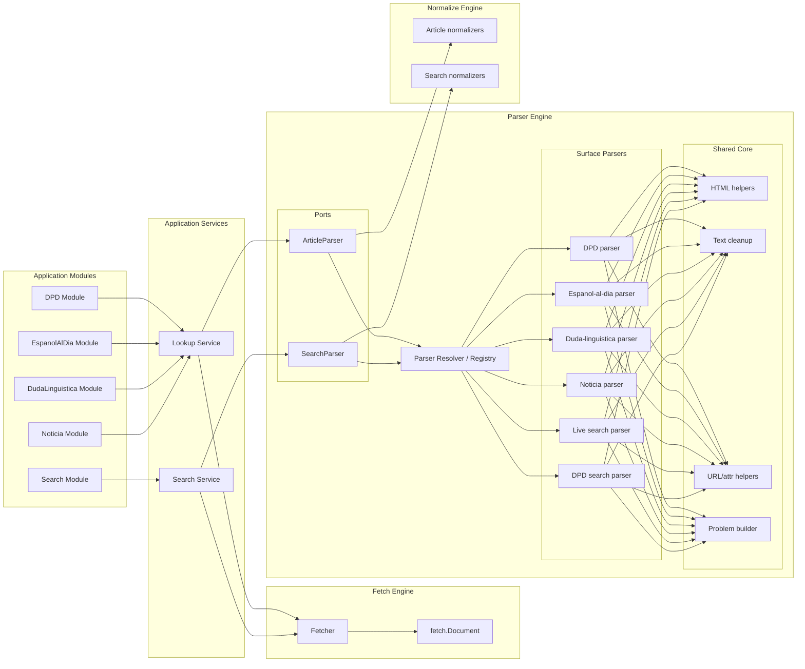

# ADR-0001: Parser Engine Architecture

## Status

Accepted

## Context

`dlexa` currently contains multiple parsers with different responsibilities:

- `parse.DPDArticleParser` parses full DPD article HTML;
- `parse.LiveSearchParser` parses general RAE search results;
- `parse.DPDSearchParser` parses the DPD entry-discovery surface.

The architecture docs already define engine responsibilities clearly:

- fetch acquires documents;
- parse transforms external documents into intermediate structures;
- normalize turns technical structure into semantically useful model shapes;
- product filtering and strategy decisions must not live in the parser layer.

As the system grows to support additional content modules such as `espanol-al-dia`, `duda-linguistica`, and possibly policy-gated `noticia`, the current parser organization is no longer sufficient:

- parser responsibilities are not yet grouped under an explicit parser engine model;
- some concrete parsers are too monolithic;
- shared parsing primitives are not yet extracted clearly;
- future surface growth risks copy-paste parser proliferation.

The user requested a parser-engine RFC aligned with the repository architecture and explicitly asked that architecture decisions now live in `docs/ARCHITECTURE.md` and ADRs under `docs/`.

## Decision

We will establish an explicit **Parser Engine** as a first-class architectural engine in `dlexa`.

This parser engine will have:

1. **One shared engine umbrella**
2. **Two parser families / ports**
   - `ArticleParser`
   - `SearchParser`
3. **Surface-specific parser strategies**
4. **A shared parser core** for low-level HTML/text/URL/document helpers
5. **No product policy filtering inside parser implementations**

### Parser Engine Responsibilities

The parser engine is responsible for:

- consuming fetched documents;
- absorbing HTML noise and DOM irregularities;
- extracting stable intermediate structures;
- classifying parser failures consistently;
- isolating external markup complexity behind parser adapters.

The parser engine is not responsible for:

- ranking or filtering according to product strategy;
- deciding whether a surface is semantically in-scope for the product;
- rendering output for agents or humans;
- mapping URLs to CLI next-step suggestions.

## Input and Output Model

The parser engine will share a common input envelope:

```go
type ParseInput struct {
    Ctx        context.Context
    Descriptor model.SourceDescriptor
    Document   fetch.Document
}
```

The parser engine will **not** expose one universal output type.

Instead, it will use separate family outputs:

### Article parsing output

```go
type ArticleParser interface {
    ParseArticle(input ParseInput) (ArticleResult, []model.Warning, error)
}

type ArticleResult struct {
    Articles []parse.ParsedArticle
    Miss     *parse.ParsedLookupMiss
}
```

### Search parsing output

```go
type SearchParser interface {
    ParseSearch(input ParseInput) ([]parse.ParsedSearchRecord, []model.Warning, error)
}
```

This split is intentional.

We reject a single “universal parser result” because it would:

- violate Interface Segregation;
- force null-heavy result contracts;
- blur article-body parsing with discovery parsing;
- reduce clarity at call sites.

## Component Architecture



## Design Patterns Adopted

### 1. Strategy

Each surface parser is a strategy:

- `DPDArticleParser`
- `EspanolAlDiaParser`
- `DudaLinguisticaParser`
- `NoticiaParser`
- `LiveSearchParser`
- `DPDSearchParser`

This allows new surfaces to be added without rewriting existing parser behavior.

### 2. Abstract Factory / Registry Resolver

A parser resolver/registry selects the correct parser by family and surface.

This prevents parser-selection logic from spreading across services or modules.

### 3. Adapter

Each parser adapts unstable upstream HTML/documents into stable internal intermediate structures.

This enforces the parser engine as an anti-corruption boundary.

### 4. Anti-Corruption Layer

The parser engine as a whole acts as the anti-corruption layer between:

- external RAE/DPD markup;
- internal parsed structures.

### 5. Template Method (lightweight, composition-first)

Shared article-parsing steps may be implemented through reusable helper flows, not heavy inheritance.

Typical shared steps:

1. validate document
2. locate content root
3. extract metadata
4. extract structured blocks
5. emit parsed result

This should be implemented via helper composition, not a giant base class.

### 6. Problem Builder

A shared parser-problem builder will centralize parser failure creation so that:

- failures are classified consistently;
- problem taxonomy becomes less DPD-specific over time;
- parsers do not duplicate boilerplate error construction.

### 7. Composition over Inheritance

Shared behavior will be extracted into parser-core helpers such as:

- HTML selection helpers
- text cleanup helpers
- URL resolution helpers
- inline extraction helpers

We explicitly reject a “god base parser” inheritance hierarchy.

## SOLID and DRY Rationale

### Single Responsibility Principle

- fetch engine fetches;
- parser engine parses;
- normalize engine derives semantic model;
- modules orchestrate business semantics;
- render produces visible output.

### Open/Closed Principle

New surfaces should be added by introducing new parser strategies, not by modifying the core engine contract.

### Liskov Substitution Principle

Any parser registered under a family must honor the contract of that family and return the expected intermediate shape.

### Interface Segregation Principle

We separate `ArticleParser` and `SearchParser` to avoid a fat parser interface.

### Dependency Inversion Principle

Application services and module orchestration should depend on parser ports/resolvers, not on concrete parser implementations.

### DRY

We will share mechanics, not semantics:

Shared:

- HTML/document utilities
- text cleanup
- URL resolution
- attribute extraction
- parser problem construction

Not shared artificially:

- surface-specific selectors
- surface-specific semantic assumptions
- policy gating
- product-level filtering

## Planned Package Direction

```text
internal/
  parse/
    engine/
      registry.go
      resolver.go
      problems.go
      article_ports.go
      search_ports.go

      shared/
        document.go
        html.go
        text.go
        attrs.go
        urls.go

      article/
        dpd/
          parser.go
          selectors.go
          mapper.go
        espanolaldia/
          parser.go
          selectors.go
          mapper.go
        dudalinguistica/
          parser.go
          selectors.go
          mapper.go
        noticia/
          parser.go
          selectors.go
          mapper.go

      search/
        live/
          parser.go
          selectors.go
        dpd/
          parser.go
          selectors.go
```

This package layout is directional, not an immediate freeze of final file names.

## Consequences

### Positive

- Parser growth becomes intentional and surface-oriented.
- Shared low-level parsing mechanics stop being duplicated.
- The engine aligns with the v2 architecture docs.
- Future modules can share parser infrastructure without sharing business policy.

### Negative / Cost

- Existing parser code, especially DPD parsing, will require staged extraction and refactoring.
- Problem taxonomy will need gradual generalization beyond DPD-only naming.
- Resolver/registry plumbing adds some upfront architectural work.

### Risks

- Over-abstracting too early could create a fake generic parser layer with weak semantics.
- `noticia` remains a risky surface even with a clean parser architecture because policy acceptance is not a parser concern.

## Migration Direction

1. Introduce shared parser-engine helpers and ports.
2. Move search parsers into the explicit engine structure.
3. Extract DPD article parser into the article parser family.
4. Add new article parsers for `espanol-al-dia` and `duda-linguistica`.
5. Add `noticia` only with explicit higher-layer policy gating.

## Rejected Alternatives

### One universal parser interface with one universal result type

Rejected because it collapses article parsing and search parsing into an artificial contract, violating Interface Segregation and reducing clarity.

### One parser per module with no shared engine core

Rejected because it would duplicate HTML/text/URL mechanics and accelerate parser drift.

### Product policy inside parser implementations

Rejected because architecture docs explicitly assign product strategy and filtering to higher layers.
