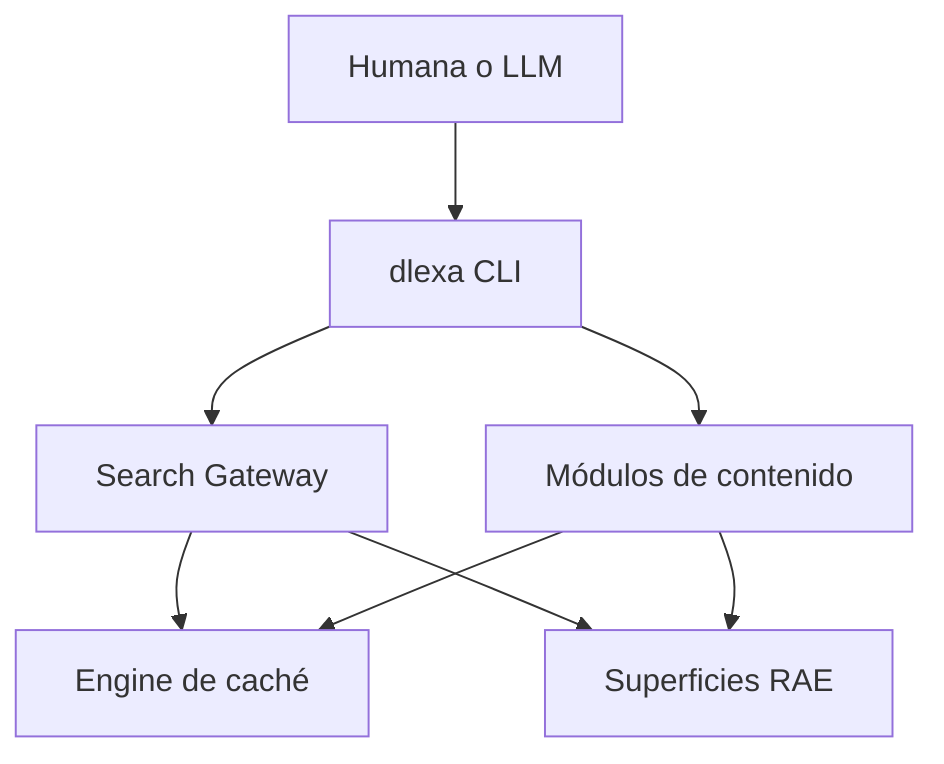
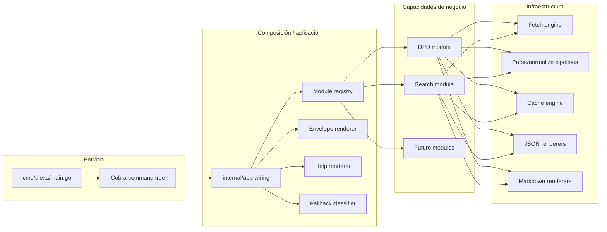
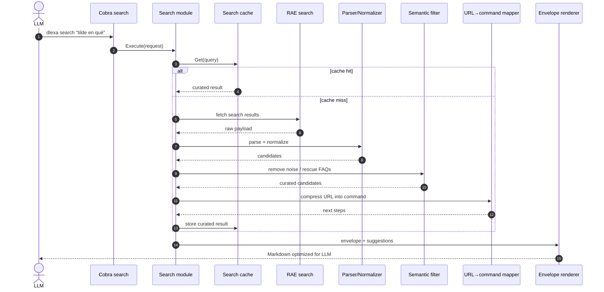
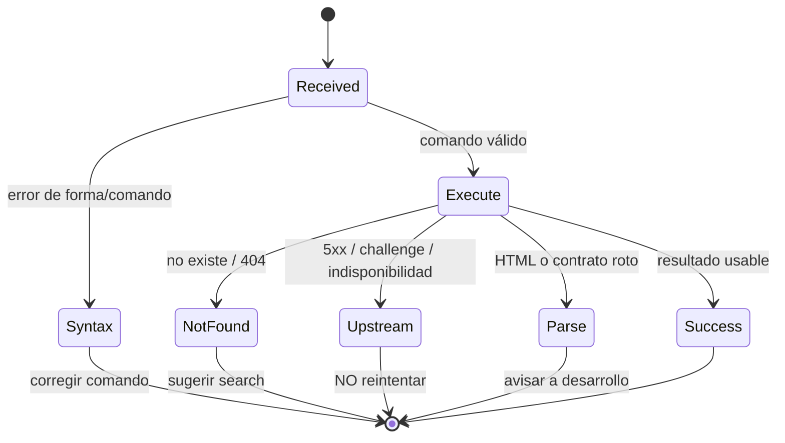

# Arquitectura Formal de Dlexa v2

**Estado**: Draft canónico de arquitectura  
**Audiencia principal**: futuros LLMs, mantenedoras humanas y subagentes SDD  
**Propósito**: ofrecer una visión completa, explícita y durable del proyecto, separada del documento narrativo/visionario.

---

## 1. Cómo leer este documento

Este documento es el artefacto arquitectónico formal de referencia para `dlexa`.

- Si un futuro agente necesita entender **qué es el proyecto**, **por qué existe**, **cómo está dividido**, **qué contratos debe respetar** y **cómo debe evolucionar**, este es el primer documento que debe leer.
- `docs/architecture_v2_oraculo.md` conserva la narrativa estratégica y la conversación que llevó a la visión.
- Este documento consolida esa visión en un modelo operativo, técnico y mantenible.

En otras palabras: el otro documento inspira; este documento gobierna.

---

## 2. Definición del proyecto

`dlexa` es una interfaz de consulta para dudas normativas del español y contenido relacionado de la RAE/entorno académico, diseñada explícitamente para ser consumida por agentes de IA mediante CLI.

No se concibe como:

- un diccionario genérico universal;
- un sistema de traducción;
- un reemplazo total de cualquier fuente lexicográfica;
- una TUI para humanos.

Se concibe como:

- una **CLI determinista**;
- un **gateway semántico** entre fuentes lingüísticas y LLMs;
- una **arquitectura modular** donde cada fuente o familia de contenido puede vivir como módulo independiente;
- un sistema que optimiza **contexto útil por token**.

---

## 3. Problema que resuelve

Las fuentes lingüísticas académicas relevantes para el español están fragmentadas.

- El DPD resuelve dudas normativas específicas.
- El buscador general de la RAE mezcla resultados valiosos con ruido institucional.
- Otras superficies como `espanol-al-dia`, `duda-linguistica` o FAQs publicadas como `noticia` contienen contenido extremadamente útil, pero mal clasificado para un agente automático.

Un LLM sin una herramienta intermedia sufre varios problemas:

1. **No sabe dónde buscar primero**.
2. **Pierde tokens** con HTML, URLs largas y contenido irrelevante.
3. **No distingue ruido institucional de contenido normativo**.
4. **No sabe qué siguiente comando ejecutar**.
5. **Falla mal** cuando recibe errores ambiguos.

`dlexa v2` existe para resolver precisamente eso.

---

## 4. Drivers arquitectónicos

### 4.1. Drivers funcionales

- Permitir consultas directas por módulo (`dpd`, `espanol-al-dia`, `duda-linguistica`, etc.).
- Permitir un flujo estándar centrado en `search`.
- Traducir resultados web en siguientes pasos ejecutables por un LLM.
- Mantener salida en Markdown por defecto y JSON como opción explícita.

### 4.2. Drivers no funcionales

- **Determinismo**: el LLM debe recibir respuestas estables y accionables.
- **Bajo desperdicio de tokens**: no enviar dominio, ruido ni metadatos inútiles si pueden inferirse o comprimirse.
- **Modularidad**: agregar nuevos módulos sin reescribir el core.
- **Tolerancia a fallos**: errores con semántica explícita.
- **Evolución gradual**: la arquitectura debe soportar una Fase 1 simple y una Fase 2 más ambiciosa sin tirar lo anterior.

---

## 5. Objetivos y no objetivos

### 5.1. Objetivos

1. Reemplazar la CLI basada en `flag` por una CLI basada en `spf13/cobra`.
2. Separar el DPD actual en un módulo formal.
3. Introducir `search` como gateway principal del workflow agentivo.
4. Estandarizar envelopes, ayuda y errores.
5. Preparar el terreno para múltiples módulos sin sobreingeniería prematura.

### 5.2. No objetivos inmediatos

1. Implementar fan-out concurrente contra múltiples motores en Fase 1.
2. Resolver desde ya todos los proveedores futuros.
3. Construir una interfaz interactiva humana basada en TUI.
4. Convertir la herramienta en un crawler general de toda la web de la RAE.

---

## 5.3. Resumen ejecutivo de decisiones arquitectónicas

Esta tabla existe para que una lectora —humana o LLM— pueda captar en un minuto las decisiones estructurales más importantes antes de entrar al detalle del documento.

| Decisión | Estado | Impacto | Razón |
|---|---|---|---|
| Reemplazar `flag` por `spf13/cobra` | Aprobada | Alto | Necesitamos subcomandos formales, help controlable y una CLI escalable. |
| Mantener Markdown como default | Aprobada | Alto | Es el mejor formato para LLMs en densidad semántica por token. |
| Tratar `search` como gateway principal | Aprobada | Alto | Ordena el workflow agentivo y reduce intentos ciegos en módulos específicos. |
| Comprimir URLs a comandos | Aprobada | Alto | Reduce desperdicio de tokens y convierte navegación en acción ejecutable. |
| Introducir módulos explícitos | Aprobada | Alto | Permite crecer sin acoplar toda la aplicación a DPD o al CLI actual. |
| Centralizar help, envelopes y fallbacks | Aprobada | Alto | Evita drift y unifica el contrato visible al agente. |
| Tratar caché como engine de primer nivel | Aprobada | Alto | La estabilidad y la latencia dependen de ella, no es una optimización cosmética. |
| Diferir fan-out agresivo | Aprobada | Medio/Alto | Primero hay que estabilizar contratos y evitar sobreingeniería o bans tempranos. |
| Rechazar TUI/Bubbletea en esta fase | Aprobada | Medio | El protocolo principal es STDIO limpio para agentes, no terminal visual interactiva. |

---

## 5.4. Estado actual vs estado objetivo

Una fuente clásica de confusión en refactorizaciones grandes es mezclar lo que el sistema **es hoy** con lo que el sistema **quiere ser**. Esta sección fija esa frontera.

| Área | Estado actual | Estado objetivo |
|---|---|---|
| CLI | `flag` estándar y ruteo manual | árbol de comandos con Cobra |
| Entry flow | lookup DPD como comportamiento dominante | `search` como gateway principal + módulos explícitos |
| Modelado de capacidades | DPD implícito en estructura técnica | módulos formales bajo contratos compartidos |
| Help | ayuda estándar de CLI tradicional | help Markdown optimizado para agentes |
| Errores | errores de aplicación más genéricos | ladder de 4 niveles con ownership explícito |
| Output default | Markdown ya existente | Markdown formalizado con envelope canónico |
| URLs de resultados | aún dependientes de formato fuente | compresión URL→comando como norma de diseño |
| Caché | presente como infraestructura | engine priorizado y preparado para evolución concurrente |
| Search | capacidad existente, no aún centro del sistema | gateway semántico y ruteador de siguientes pasos |

### Cómo usar esta tabla

- Si estás leyendo código existente, asumí que **todavía vas a encontrar rastros del estado actual**.
- Si estás diseñando cambios, alineate con el **estado objetivo**, salvo que una fase concreta diga lo contrario.
- Si hay conflicto entre ambos, el documento arquitectónico manda sobre la inercia accidental del código legado.

---

## 6. Principios arquitectónicos

### 6.1. Search-first, module-deep

El flujo estándar será de dos pasos:

1. **Buscar** (`dlexa search "consulta"`)
2. **Profundizar** (`dlexa <modulo> <id>`)

No todos los casos pasarán por `search`, pero la arquitectura debe tratarlo como el corazón del workflow.

### 6.2. Markdown-first

El output por defecto será Markdown porque:

- comprime mejor la intención por token;
- se alinea naturalmente con el entrenamiento de los LLMs;
- permite headers, listas y ejemplos copiables;
- es legible también por humanas cuando hay debugging.

JSON seguirá existiendo como formato opcional para automatización estricta.

### 6.3. URL compression by command mapping

Una URL completa de la RAE desperdicia tokens. La arquitectura la reinterpreta como comando ejecutable.

Ejemplo:

- URL original: `https://www.rae.es/espanol-al-dia/la-conjuncion-o-siempre-sin-tilde`
- Forma optimizada: `dlexa espanol-al-dia la-conjuncion-o-siempre-sin-tilde`

Esto convierte navegación web en lenguaje operativo para agentes.

### 6.4. Error clarity over generic failure

Un error ambiguo hace que el LLM reintente a ciegas. Un error semántico lo guía.

### 6.5. Evolución iterativa

Primero se construyen cimientos sólidos. Después se habilita la explosión concurrente.

---

## 6.6. Invariantes arquitectónicos

Los invariantes son reglas que no deberían romperse salvo decisión arquitectónica explícita. Sirven como defensa contra la degradación gradual del sistema.

1. **Markdown es el formato por defecto** salvo decisión documentada en contrario.
2. **Ningún módulo debería exponer HTML crudo** al consumidor final como salida principal.
3. **`search` no debe devolver meros links crudos** si puede devolver comandos accionables.
4. **La lógica de negocio no debe vivir en `cmd/`**; `cmd/` conecta, no gobierna dominio.
5. **Todo error clasificable debe caer en la ladder formal de fallbacks**.
6. **La compresión URL→comando es preferible a la repetición de dominios largos** cuando no haya pérdida de semántica.
7. **Los módulos deben hablar a través de contratos compartidos**, no mediante dependencias accidentales del framework CLI.
8. **La caché debe ser visible en la semántica de salida** (`HIT/MISS`) cuando corresponda.
9. **Agregar un módulo nuevo implica definir cómo busca, cómo responde y cómo falla**.

Estos invariantes no eliminan toda decisión futura, pero sí acotan el espacio de improvisación destructiva.

---

## 7. Vista de contexto del sistema



### Lectura de esta vista

- El usuario puede invocar directamente un módulo o pasar primero por `search`.
- `search` y los módulos comparten servicios de fetch, parseo, render y caché.
- El objetivo del sistema no es exponer HTML, sino exponer **contexto curado**.

---

## 8. Estilo arquitectónico elegido

La arquitectura objetivo sigue una interpretación pragmática de **Ports and Adapters / Hexagonal Architecture**.

### Núcleo de la idea

- La CLI es un adaptador de entrada.
- Cada módulo es un componente de aplicación con contrato explícito.
- Los fetchers/scrapers/parsers de fuentes externas son adaptadores de salida.
- El renderer envelope funciona como servicio transversal.

No buscamos pureza dogmática. Buscamos separación útil.

---

## 9. Componentes principales



---

## 10. Modelo de comandos

### 10.1. Superficie objetivo

La CLI objetivo se organiza así:

- `dlexa <query>` → lookup por defecto orientado a DPD (compatibilidad + ergonomía)
- `dlexa dpd <query>` → acceso explícito al DPD
- `dlexa search <query>` → gateway semántico
- `dlexa <modulo> <id>` → profundización directa para módulos de contenido
- `dlexa --help` y `dlexa <cmd> --help` → ayuda optimizada para agentes

### 10.2. Criterio de diseño

La CLI no debe obligar al LLM a inventar sintaxis. Debe entregarle una gramática pequeña, regular y predecible.

---

## 11. Módulos

### 11.1. Qué es un módulo

Un módulo representa una superficie de contenido o capacidad de consulta con comportamiento propio y contrato uniforme.

Ejemplos actuales/objetivo:

- `dpd`
- `search`
- `espanol-al-dia`
- `duda-linguistica`
- `noticia` (solo cuando el contenido sea normativamente valioso)

### 11.2. Qué NO es un módulo

No todo path merece automáticamente una arquitectura aislada. Si dos superficies comparten la misma semántica y plantilla operativa, pueden vivir bajo el mismo conjunto de adaptadores internos.

La clasificación de URL sirve para decidir flujo y contrato, no para explotar el árbol de carpetas sin control.

---

## 12. Contrato base de módulos

```go
package modules

type Module interface {
    Name() string
    Command() string
    Execute(ctx context.Context, req Request) (Response, error)
}

type Request struct {
    Query   string
    Format  string
    NoCache bool
    Args    []string
}

type Response struct {
    Title      string
    Source     string
    CacheState string
    Format     string
    Body       []byte
    Fallback   *FallbackEnvelope
}
```

### Intención del contrato

- `Name()` identifica semánticamente el módulo.
- `Command()` define el subcomando público.
- `Execute(...)` desacopla Cobra de la lógica de negocio.
- `Response` fuerza un shape común para enveloping y fallbacks.

---

## 13. Search como gateway semántico

`search` no es solo una búsqueda textual. Es un **orquestador de contexto**.

Su responsabilidad es:

1. consultar el buscador fuente;
2. normalizar candidatos;
3. filtrar ruido;
4. rescatar contenido valioso mal clasificado;
5. traducir URLs a siguientes pasos ejecutables.

### Ejemplo clave

Una URL `/noticia/...` normalmente sería descartable. Pero si el título contiene `Preguntas frecuentes:` puede ser oro puro para un LLM.

Entonces el sistema debe aplicar el principio:

> filtrar ruido, pero permitir desfiltrar excepciones lingüísticamente valiosas.

### 13.1. Modelo conceptual del resultado curado de search

Aunque la implementación exacta pueda variar entre Markdown y JSON, el resultado curado del `search` debe preservar cierta semántica estable para que el agente entienda qué obtuvo y qué hacer después.

Campos conceptuales esperables por resultado:

| Campo | Propósito |
|---|---|
| `title` | Título principal del resultado, útil para priorización y lectura rápida |
| `snippet` | Resumen corto o bajada, útil para decidir relevancia |
| `module` | Módulo destino inferido desde la URL o clasificación semántica |
| `id` | Identificador o slug reutilizable en el siguiente comando |
| `next_command` | Comando literal sugerido para profundizar |
| `classification` | Tipo semántico del resultado (`faq`, `dpd-entry`, `article`, `noise`, etc.) |
| `source_hint` | Pista de procedencia si aporta contexto útil sin despilfarro de tokens |

No todos estos campos tienen que exponerse del mismo modo en todos los formatos, pero el sistema debe razonar internamente con una estructura equivalente.

### 13.2. Ejemplo conceptual

```json
{
  "title": "¿Cuándo se escriben con tilde los adverbios en -mente?",
  "snippet": "Respuesta breve sobre la acentuación de adverbios terminados en -mente.",
  "module": "duda-linguistica",
  "id": "cuando-se-escriben-con-tilde-los-adverbios-en-mente",
  "next_command": "dlexa duda-linguistica cuando-se-escriben-con-tilde-los-adverbios-en-mente",
  "classification": "linguistic-article"
}
```

### 13.3. Razón arquitectónica del modelo curado

Este shape conceptual existe para que el agente no tenga que:

- parsear manualmente URLs;
- inferir el subcomando correcto;
- adivinar si un resultado es ruido o contenido útil;
- improvisar el siguiente paso.

En otras palabras: el `search` no entrega solo resultados; entrega **navegación semántica comprimida**.

---

## 14. Secuencia formal del search



---

## 15. Envelope renderer

El envelope renderer es un servicio transversal que unifica la salida visible al agente.

### Contrato base

```go
package render

type EnvelopeRenderer interface {
    RenderSuccess(ctx context.Context, env Envelope, body []byte) ([]byte, error)
    RenderHelp(ctx context.Context, help HelpEnvelope) ([]byte, error)
    RenderFallback(ctx context.Context, fb FallbackEnvelope) ([]byte, error)
}
```

### Responsabilidades

- agregar encabezado contextual estándar;
- informar fuente y estado de caché;
- renderizar ayuda en Markdown;
- renderizar fallbacks con semántica explícita;
- mantener coherencia entre módulos.

### Ejemplo conceptual de envelope Markdown

```markdown
# [dlexa:search] tilde en qué
*Fuente: búsqueda general RAE | Caché: MISS*

---

## Resultados destacados
- ...
```

---

## 16. Sistema de ayuda para agentes

La ayuda de Cobra por defecto resuelve el problema de una CLI humana tradicional: enumera comandos, flags y una breve descripción. Eso sirve para una persona que ya conoce el dominio o que puede inferir intenciones leyendo texto suelto. Para un LLM, eso es insuficiente.

Un agente necesita que la ayuda cumpla tres funciones simultáneas:

1. **documentar sintaxis**;
2. **enseñar estrategia de uso**;
3. **indicar recuperación ante error**.

Por eso, la ayuda en `dlexa v2` no será un subproducto de Cobra: será una superficie de producto.

### 16.1. Objetivos de la ayuda

La ayuda debe permitir que un agente, sin contexto previo de la herramienta, pueda:

- identificar cuál es el comando correcto para su intención;
- copiar ejemplos reales y modificarlos mínimamente;
- distinguir entre búsqueda exploratoria y consulta directa;
- saber qué hacer cuando un módulo no encuentra el contenido deseado;
- reconocer cuándo conviene usar `search` en vez de insistir con un módulo específico.

### 16.2. Propiedades obligatorias

La ayuda deberá ser:

- **Markdown-first**;
- **compacta pero no críptica**;
- **rica en ejemplos**;
- **orientada a acción**;
- **consistente entre root y subcomandos**.

### 16.3. Estructura objetivo del help

Cada comando debería renderizar ayuda con esta estructura lógica:

1. **qué hace** el comando;
2. **sintaxis mínima**;
3. **ejemplos válidos**;
4. **errores comunes**;
5. **siguiente paso sugerido si falla**.

Ejemplo conceptual:

```markdown
# Ayuda: dlexa dpd

Consulta una entrada del Diccionario panhispánico de dudas.

## Sintaxis
`dlexa dpd <termino>`

## Ejemplos
- `dlexa dpd basto`
- `dlexa dpd que`

## Si no encuentras el término
Usa primero:
`dlexa search <consulta>`
```

### 16.4. Por qué esto importa arquitectónicamente

En una app tradicional, `--help` es documentación auxiliar. En `dlexa`, `--help` forma parte del protocolo conversacional entre herramienta y agente.

Si el help está mal diseñado:

- el LLM prueba comandos erróneos;
- consume más tokens en retries;
- puede confundir lookup directo con discovery search;
- puede insistir con una superficie incorrecta.

Si el help está bien diseñado:

- la herramienta se vuelve autoexplicable;
- el costo cognitivo del agente baja;
- el sistema se hace más resiliente incluso antes de tocar red.

### 16.5. Regla de implementación

La ayuda debe salir de una sola estrategia de renderizado coherente, no de textos armados ad hoc por cada comando. Eso evita drift entre módulos y vuelve posible probarla de forma determinista.

---

## 17. Sistema formal de fallbacks

Los fallbacks son uno de los núcleos de la arquitectura agentiva. No son simples mensajes de error "bonitos". Son una capa de control de flujo para impedir que el LLM entre en loops inútiles o extraiga conclusiones incorrectas.

El sistema tendrá cuatro niveles explícitos.



### 17.1. Nivel 1 — Syntax Error

Este error ocurre cuando el agente falló en la sintaxis de la CLI.

Casos típicos:

- omitió un argumento obligatorio;
- llamó un subcomando inexistente;
- combinó flags incompatibles;
- pasó múltiples tokens donde el contrato esperaba uno solo.

Respuesta esperada del sistema:

- explicitar que el error es de uso;
- mostrar la forma correcta;
- sugerir `--help` cuando aplique.

Lo importante es que el agente entienda: **todavía no llegaste al dominio; corregí la forma del comando**.

### 17.2. Nivel 2 — Not Found

Este error ocurre cuando el comando es válido, pero la superficie consultada no tiene el contenido solicitado.

Casos típicos:

- el término no existe en DPD;
- el slug no corresponde a una página encontrada;
- el módulo es correcto, pero el contenido específico no está ahí.

Respuesta esperada del sistema:

- dejar claro que la CLI fue invocada correctamente;
- dejar claro que el fallo es de hallazgo, no de sintaxis;
- sugerir usar `search` como escalamiento natural.

Mensaje conceptual:

> No se encontró el contenido en este módulo. Probá con `dlexa search <consulta>`.

### 17.3. Nivel 3 — Upstream Unavailable

Este error ocurre cuando la fuente externa no está disponible o responde de forma transitoriamente inutilizable.

Casos típicos:

- HTTP 5xx;
- timeout severo;
- challenge o rate limit del sitio;
- degradación temporal del servidor de origen.

Respuesta esperada del sistema:

- explicitar que el problema es externo;
- instruir al agente a **no reintentar ciegamente**;
- evitar que la CLI induzca un comportamiento equivalente a un mini-DDoS por loops automáticos.

Este nivel es crítico porque muchos agentes, si reciben un error genérico, vuelven a intentar sin discriminación.

### 17.4. Nivel 4 — Parse Failure

Este error ocurre cuando la fuente respondió, pero el contrato externo cambió o nuestro parser quedó inválido.

Casos típicos:

- cambió el HTML;
- cambió la jerarquía del DOM;
- cambió el shape esperado del documento;
- la página contiene contenido parcialmente roto o inyectado en una estructura nueva.

Respuesta esperada del sistema:

- aclarar que el fetch sí ocurrió;
- aclarar que falló la interpretación;
- instruir al agente a derivar la situación a mantenimiento humano.

### 17.5. Ownership model de los errores

La gran decisión de este sistema es que todo error debe responder la pregunta:

> ¿quién corrige esto?

| Error | Responsable principal |
|---|---|
| Syntax | LLM / usuaria que invocó mal |
| Not Found | estrategia de búsqueda |
| Upstream | proveedor externo |
| Parse Failure | mantenedora de `dlexa` |

Ese ownership explícito es lo que vuelve útil al fallback.

### 17.6. Regla de diseño

Nunca devolver un error desnudo si puede clasificarse en uno de estos cuatro niveles. Un error no clasificado es una fuga de abstracción.

---

## 18. Engine de caché

La caché es un engine de primer nivel, no un detalle accesorio ni una optimización tardía. En un sistema pensado para agentes, la caché define latencia, estabilidad y costo operativo.

### 18.1. Por qué la caché importa tanto aquí

`dlexa` trabaja contra fuentes web externas que:

- no controlamos;
- pueden responder lento;
- pueden cambiar sin aviso;
- pueden castigar patrones agresivos de scraping;
- no están diseñadas con mentalidad de herramienta para LLM.

Sin caché, el sistema sería:

- más lento;
- más frágil;
- más costoso en retries;
- más riesgoso frente a bans o rate limits futuros.

### 18.2. Responsabilidades de la caché en Fase 1

En la primera etapa, la caché debe resolver como mínimo:

- memoización de consultas repetidas;
- reducción de latencia visible para el agente;
- desacople parcial respecto del tiempo de respuesta upstream;
- señalización clara de `HIT/MISS` en el envelope.

### 18.3. Responsabilidades de la caché en fases futuras

En etapas más avanzadas, la caché deberá evolucionar para soportar:

- multi-superficie concurrente;
- claves por proveedor, módulo y consulta normalizada;
- invalidación más fina;
- TTLs ajustables por tipo de contenido;
- potencial `stale-while-revalidate`;
- coordinación segura ante concurrencia real.

### 18.4. Qué debe cachearse

La arquitectura admite varias capas posibles de caché:

1. **payload bruto** descargado;
2. **resultado parseado/normalizado**;
3. **resultado ya curado para el LLM**.

No es obligatorio resolver todas esas capas en Fase 1, pero el diseño debe dejar abierta esa posibilidad.

### 18.5. Principio de diseño

La caché no debe alterar semántica. Debe acelerar y estabilizar, no introducir ambigüedad sobre el origen o frescura del dato.

Por eso el envelope debe decir claramente si hubo `HIT` o `MISS`.

### 18.6. Restricción deliberada

En Fase 1 no se fuerza todavía fan-out agresivo. Eso significa que no hace falta sobrecomplicar la caché desde ya con sincronización distribuida o estrategias avanzadas. Pero sí hace falta documentarla como engine prioritario, porque va a ser una pieza central cuando llegue la expansión.

---

## 19. Fetch engine y parsing

El proyecto actual ya posee pipelines de `fetch`, `parse` y `normalize`. La arquitectura v2 no parte de cero: reorganiza y recontextualiza esas capacidades dentro de un modelo modular explícito.

### 19.1. Responsabilidad del fetch engine

El fetch engine debe encargarse de:

- construir requests a la fuente correcta;
- gestionar timeouts y contexto de cancelación;
- devolver payloads o errores clasificables;
- permanecer separado de decisiones de renderizado.

No debe decidir:

- cómo se le habla al LLM;
- cómo se presenta el fallback final;
- cómo se convierte una URL en siguiente comando.

### 19.2. Responsabilidad del parser

El parser transforma documentos externos en estructuras intermedias que el dominio pueda entender.

Debe absorber:

- ruido del HTML;
- irregularidades del DOM;
- diferencias entre superficies de contenido.

No debe filtrar según estrategia de producto. Eso corresponde a capas superiores como el router semántico.

### 19.3. Responsabilidad de normalize

La normalización es la frontera entre estructura técnica y semántica útil.

Ejemplos:

- normalizar etiquetas o títulos;
- extraer `path segments` útiles;
- limpiar formatos inconsistentes;
- convertir resultados heterogéneos en candidatos comparables.

### 19.4. Anti-corruption layer

La web de la RAE y superficies parecidas deben ser tratadas como sistemas externos con contrato inestable. La arquitectura debe actuar como capa anticorrupción.

Eso significa:

- nunca filtrar HTML crudo a la salida final;
- nunca acoplar la CLI a selectores DOM repartidos por cualquier lado;
- nunca hacer que el LLM tenga que deducir estructura web que la herramienta podría haber resuelto antes.

### 19.5. Regla de encapsulamiento

La complejidad externa debe morir dentro de adaptadores. Si una decisión depende de cómo se ve el HTML, no pertenece al contrato público del módulo.

---

## 20. Formatos de salida

El sistema soporta dos formatos principales, pero no los trata como equivalentes simétricos. Cada uno responde a una necesidad distinta.

### 20.1. Markdown como formato primario

Markdown es el formato por defecto porque maximiza densidad semántica útil por token.

Ventajas:

- es natural para LLMs;
- permite headers y jerarquía textual clara;
- funciona bien con ejemplos copiados literalmente;
- es legible por humanas cuando hace falta debugging;
- evita verbosidad estructural innecesaria.

### 20.2. JSON como formato secundario y explícito

JSON seguirá existiendo porque algunos flujos automáticos necesitan contratos más rígidos.

Sin embargo, la arquitectura no debe optimizar primero para JSON si eso sacrifica la ergonomía agentiva del caso principal.

### 20.3. Regla de precedencia

La pregunta no es “qué formato es más puro”, sino “qué formato sirve mejor al workflow dominante”. En `dlexa v2`, ese workflow dominante es LLM + terminal + razonamiento textual.

Por eso Markdown gana por defecto.

### 20.4. Compatibilidad y disciplina

Markdown puede evolucionar visualmente siempre que preserve:

- envelope;
- secciones reconocibles;
- ejemplos o siguientes pasos donde corresponda.

JSON debe tratarse con más conservadurismo porque es más probable que sea consumido por automatizaciones estrictas.

### 20.5. Política sobre URLs

Cuando una URL completa no agrega valor al flujo agentivo, debe evitarse en la salida principal.

La arquitectura prioriza devolver:

- módulo;
- identificador útil;
- siguiente comando;

antes que repetir dominios largos como `https://www.rae.es/...`.

Eso no significa prohibir completamente las URLs, sino tratarlas como dato secundario, no como unidad principal de interacción.

---

## 21. Layout objetivo del repositorio

```text
cmd/
└── dlexa/
    ├── main.go
    ├── root.go
    ├── dpd.go
    └── search.go

internal/
├── app/
│   └── wiring.go
├── modules/
│   ├── dpd/
│   ├── search/
│   └── ... futuros módulos ...
├── render/
│   └── envelope.go
├── cache/
├── fetch/
├── parse/
├── normalize/
└── ... infraestructura existente ...
```

### 21.1. Lectura arquitectónica del árbol

El árbol propuesto intenta balancear dos necesidades:

- que la intención de negocio sea visible;
- que la infraestructura reutilizable siga teniendo lugar propio.

### 21.2. Rol de `cmd/`

`cmd/dlexa` debe contener una superficie delgada. Su trabajo es:

- declarar comandos;
- conectar flags y args con contratos de aplicación;
- delegar a wiring y módulos.

No debe convertirse en el lugar donde vive lógica de scraping, clasificación o renderizado complejo.

### 21.3. Rol de `internal/app/`

`internal/app` debe comportarse como composition root.

Su misión es:

- crear dependencias;
- resolver módulos;
- unir renderer, caché y servicios existentes;
- mantener la topología de ejecución del sistema.

### 21.4. Rol de `internal/modules/`

Acá vive la intención funcional principal.

Cada módulo toma infraestructura reutilizable y la reordena según una semántica concreta. Eso permite que futuros módulos compartan engines sin compartir necesariamente estrategia de negocio.

### 21.5. Rol de `internal/render/`

`render` deja de ser solo una utilidad de formato y pasa a tener una responsabilidad arquitectónica central: materializar el contrato visible al agente.

### 21.6. Rol de `cache`, `fetch`, `parse`, `normalize`

Estas carpetas representan capacidades transversales. La arquitectura no las elimina; las subordina a un modelo más explícito de módulos y contracts.

### 21.7. Principio rector

El árbol debe gritar intención de negocio sin renunciar a infraestructura reutilizable. Ni puro dominio abstracto ni puro pipeline técnico suelto.

---

## 22. Roadmap arquitectónico

El roadmap no es un wishlist difuso. Es una secuencia de maduración intencional.

### 22.1. Fase 1 — Cimientos sólidos

Objetivo: reemplazar el ruteo frágil actual por una base modular y testeable.

Entregables:

- Cobra como nueva superficie CLI;
- DPD como módulo explícito;
- Search como gateway semántico inicial;
- Envelope renderer;
- Help Markdown;
- 4-level fallback.

Criterio de salida de Fase 1:

- la CLI ya no depende de `flag` para su ruteo principal;
- `search` ya devuelve siguientes pasos útiles;
- la ayuda y los fallbacks son consistentes;
- el sistema es más explicable a un LLM que en la versión anterior.

### 22.2. Fase 2 — Expansión controlada

Objetivo: robustecer engines para soportar más volumen y más módulos sin perder claridad.

Entregables probables:

- endurecimiento del engine de caché;
- posibilidad de fan-out/fan-in con goroutines;
- incorporación de más superficies académicas;
- heurísticas más sofisticadas por proveedor.

Criterio de entrada a Fase 2:

- contratos de módulo y envelope estabilizados;
- Search inicial ya validado en la práctica;
- tests suficientes para proteger la evolución.

### 22.3. Fase 3 — Orquestación semántica avanzada

Objetivo: pasar de un gateway útil a un motor federado más ambicioso.

Posibilidades:

- federación de múltiples buscadores;
- ranking y curación entre superficies;
- estrategias semánticas más ricas para agentes complejos;
- mayor aprovechamiento del contexto lingüístico transversal.

La clave es que Fase 3 no puede nacer de humo. Tiene que apoyarse sobre Fase 1 y 2 resueltas con disciplina.

---

## 23. Testing strategy

La arquitectura está alineada con **Strict TDD** habilitado en SDD. Eso no es un decorado. Es una decisión de seguridad para una migración estructural delicada.

### 23.1. Qué se debe probar en unit

Pruebas unitarias esperadas:

- validación de argumentos Cobra;
- mapping URL→command;
- clasificación de fallbacks;
- render de envelope;
- lógica de filtrado semántico del search.

Estas pruebas deben ser rápidas y muy focalizadas.

### 23.2. Qué se debe probar en integración

Pruebas de integración esperadas:

- wiring entre comandos y módulos;
- uso real de servicios existentes de lookup y search;
- interacción entre caché, parser y render final;
- compatibilidad del flujo de `dlexa <query>` como atajo DPD.

### 23.3. Qué se debe proteger como regresión

Hay contratos que no pueden romperse a la ligera:

- compatibilidad de `--format json`;
- comportamiento esencial del lookup actual;
- shape reconocible del envelope;
- semántica de errores.

### 23.4. Testing del help

El help también debe probarse. No es texto cosmético. Es parte del protocolo de interacción.

Hay que verificar:

- que existan ejemplos correctos;
- que la sintaxis mostrada sea consistente;
- que las sugerencias posteriores a fallo no se degraden con el tiempo.

### 23.5. Testing de fixtures y heurísticas

Las heurísticas del search deben vivir acompañadas de fixtures que capturen casos como:

- noticias descartables;
- noticias rescatables por `Preguntas frecuentes:`;
- páginas `espanol-al-dia` legítimas;
- rutas no lingüísticas que deben filtrarse.

### 23.6. Regla cultural

No se trata solo de que compile. Se trata de preservar comportamiento, contrato y explicabilidad frente al cambio.

---

## 24. Riesgos arquitectónicos

| Riesgo | Impacto | Mitigación |
|---|---|---|
| Sobrediseñar antes de tiempo | Alto | limitar Fase 1 a contratos esenciales |
| Cambios en HTML externo | Alto | parsers encapsulados + fallback explícito |
| Desperdicio de tokens | Alto | compresión URL→command + filtro semántico |
| Reintentos ciegos del LLM | Alto | error ladder clara |
| Explosión de módulos triviales | Medio | distinguir superficie semántica de path accidental |
| Baneo/rate limit futuro | Medio/Alto | diferir fan-out y robustecer caché primero |

### 24.1. Sobrediseño prematuro

El proyecto tiene una visión ambiciosa. Eso es una ventaja y un peligro. La arquitectura debe evitar modelar desde ya todos los módulos imaginables si todavía no están validados en uso real.

### 24.2. Fragilidad externa

Toda integración con superficies HTML ajenas es vulnerable al cambio. Por eso el encapsulamiento del parsing y los fallbacks de nivel 4 no son optativos: son parte de la supervivencia del sistema.

### 24.3. Economía de tokens

La optimización de tokens no es un detalle de performance estética. Afecta costo, claridad y capacidad de razonamiento del agente. Por eso la compresión URL→command es una decisión estructural, no cosmética.

### 24.4. Riesgo conductual de agentes

Un LLM mal guiado no solo se equivoca: insiste. Por eso la semántica de errores y ayuda es una defensa arquitectónica frente a comportamientos automáticos defectuosos.

### 24.5. Riesgo de proliferación caótica de módulos

Si cada path se convierte en módulo sin criterio, el árbol del proyecto se transforma en un zoológico inmanejable. La arquitectura debe distinguir entre diferencias semánticas reales y simples variaciones accidentales de URL.

### 24.6. Riesgo operativo futuro

Cuando llegue el momento del fan-out, aparecerán riesgos nuevos: bans, rate limits, coordinación de caché y latencias cruzadas. Por eso esa fase se difiere conscientemente.

---

## 25. Decisiones tomadas hasta ahora

### 25.1. No Bubbletea en esta etapa

Se rechaza Bubbletea porque el sistema está orientado a agentes que consumen STDIO limpio. Una TUI introduciría ruido ANSI y complejidad orientada a interacción humana visual.

### 25.2. Sí Cobra como base de CLI

Se elige Cobra porque formaliza subcomandos, mejora help, ordena la superficie pública y reemplaza el ruteo manual con `flag` que hoy limita la evolución.

### 25.3. Markdown sigue siendo el default

No hay razón termonuclear para cambiar el formato por defecto. Markdown ofrece mejor economía de tokens y mejor afinidad con LLMs.

### 25.4. Search como gateway principal

Se establece que el workflow estándar será search-first, module-deep. Eso ordena mentalmente el sistema y le da al LLM una puerta de entrada obvia.

### 25.5. Las URLs se comprimen a comandos

Se adopta la regla de convertir `https://www.rae.es/<modulo>/<slug>` en `dlexa <modulo> <slug>` siempre que eso represente mejor el flujo agentivo.

### 25.6. La caché es un engine prioritario

No se trata como optimización marginal. Se documenta como pieza estructural actual y futura.

### 25.7. Strict TDD queda habilitado

La evolución de esta arquitectura se hará con disciplina de Red → Green → Refactor. Eso protege una migración que toca superficie pública, wiring interno y contratos.

### 25.8. El fan-out agresivo se difiere

La visión futura permanece viva, pero no se implementa todavía. Primero se estabilizan contratos, módulos y comportamiento básico.

---

## 26. Preguntas abiertas vivas

Estas preguntas no bloquean la comprensión general del sistema, pero sí afectan decisiones finas de implementación y evolución.

### 26.1. `doctor` como flag o subcomando

Opciones:

- mantener `--doctor` por compatibilidad mínima;
- migrar a `dlexa doctor` por consistencia total con Cobra.

Tradeoff:

- compatibilidad versus pureza del modelo de comandos.

### 26.2. Extensibilidad multi-proveedor desde Fase 1 o después

Opciones:

- diseñar sólo para RAE/DPD en Fase 1;
- abrir puntos de extensión más generales desde el comienzo.

Tradeoff:

- foco y velocidad ahora versus flexibilidad futura.

### 26.3. Registry dinámico versus wiring explícito

Opciones:

- wiring explícito en `internal/app` para mantener simplicidad;
- registry de módulos desde temprano para facilitar escala.

Tradeoff:

- claridad actual versus elasticidad a largo plazo.

### 26.4. Granularidad real de módulos

Opciones:

- un módulo por superficie semántica fuerte;
- agregaciones internas cuando varias rutas compartan casi todo el comportamiento.

Tradeoff:

- explicitud versus proliferación de piezas.

---

## 27. Guía para futuros LLMs

Si sos un agente leyendo esto en el futuro, tus reglas de oro son las siguientes.

### 27.1. Entendé el propósito antes de tocar código

`dlexa` no existe para "scrapear páginas". Existe para convertir conocimiento lingüístico disperso en contexto determinista y accionable para agentes.

### 27.2. Tratá `search` como núcleo de discovery

Si dudás entre lookup directo o exploración, `search` suele ser el punto de entrada más seguro.

### 27.3. No devuelvas trabajo no hecho al LLM

Si la herramienta puede filtrar ruido, comprimir URLs, clasificar errores o sugerir siguiente comando, debe hacerlo. No delegues al modelo tareas mecánicas que el sistema puede resolver de forma determinista.

### 27.4. No metas TUIs donde hace falta protocolo textual

STDIO limpio > terminal bonita. Esta regla no es estética; es funcional.

### 27.5. No rompas el envelope

El envelope es parte del contrato cognitivo del sistema. Puede evolucionar, pero no desaparecer arbitrariamente.

### 27.6. No agregues módulos sin pensar en semántica, testing y fallback

Cada nuevo módulo debe justificar:

- qué problema resuelve;
- qué contrato adopta;
- cómo falla;
- qué pruebas lo cubren.

### 27.7. No optimices por brevedad si mutila comprensión

En este proyecto, la compresión útil importa, pero no a costa de vaciar arquitectura. La brevedad es una herramienta, no una religión.

### 27.8. Workflow recomendado para agentes

Flujo de alto nivel:

1. leer esta arquitectura;
2. revisar SDD vigente;
3. usar `search` cuando el contenido exacto no sea obvio;
4. pasar a un módulo específico usando el comando sugerido;
5. interpretar fallbacks según ownership del error;
6. preservar Markdown default salvo necesidad fuerte.

---

## 28. Conclusión

`dlexa v2` no es simplemente una refactorización de CLI ni un reacomodamiento de carpetas. Es una reorientación completa del proyecto hacia una premisa más seria: una herramienta lingüística pensada desde el principio para ser útil a agentes autónomos.

La transformación tiene varias capas simultáneas:

- una capa de **superficie pública**, donde Cobra reemplaza ruteo manual frágil;
- una capa de **modelo mental**, donde `search` pasa a ser gateway y no accesorio;
- una capa de **economía de contexto**, donde URLs y ruido institucional se convierten en comandos y señales útiles;
- una capa de **resiliencia**, donde errores y ayuda dejan de ser textos genéricos para volverse instrucciones operativas;
- una capa de **evolución**, donde módulos futuros pueden crecer sobre contratos explícitos y no sobre improvisación acumulada.

La pregunta central de esta arquitectura no es solamente “cómo consultamos la RAE”. La pregunta central es:

> ¿cómo construimos una herramienta que entregue exactamente el contexto correcto, en el formato correcto, con el siguiente paso correcto, para que un agente pueda razonar mejor y equivocarse menos?

La respuesta arquitectónica de `dlexa v2` es:

- buscar primero cuando haga falta descubrir;
- profundizar después con módulos explícitos;
- comprimir todo lo irrelevante;
- elevar todo lo normativamente valioso;
- fallar con semántica;
- evolucionar sin traicionar el contrato.

Ese es el corazón del Oráculo Determinista. Y si esta arquitectura se respeta con disciplina, futuros LLMs no solo van a usar `dlexa`: van a entender por qué existe y cómo hacerlo crecer sin destruirlo.
