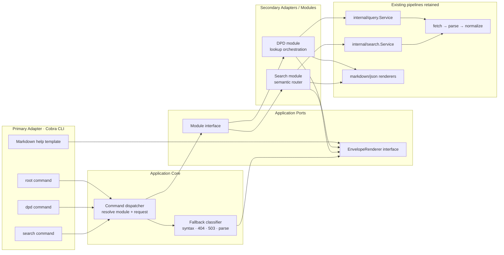
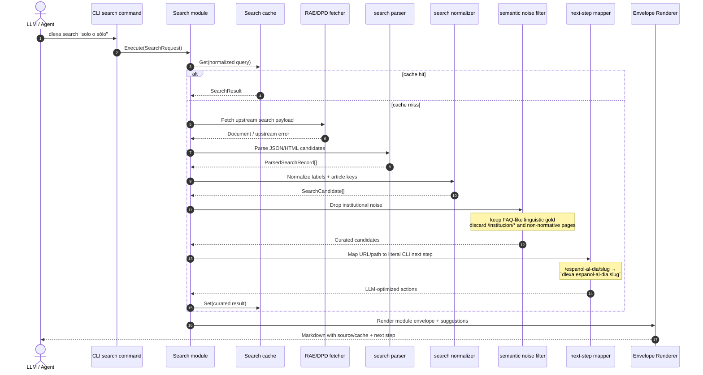

# Dlexa V2: El Oráculo Determinista (Motor Semántico del Español)
**Documento de Arquitectura y Diseño para Agentes Autónomos (Agentic RAG)**
**Estado:** Aprobado (Fase de Diseño finalizada tras sesión de Grill-Me intensiva)

---

## 1. Visión General: Del DPD a la API Universal
`dlexa` deja de ser un simple cliente CLI para el Diccionario Panhispánico de Dudas y evoluciona para convertirse en el **puente de ultra baja latencia y alto contexto** entre el conocimiento humano estructurado de la RAE/Fundéu y el razonamiento de los Modelos de Lenguaje Grande (LLMs).

El objetivo es construir una **Arquitectura de Búsqueda Federada** curada semánticamente, que exponga el español normativo a la Inteligencia Artificial sin fricciones, sin pérdida de tokens innecesaria y con instrucciones explícitas.

---

## 2. Interfaz y Experiencia de I/O (La CLI Pura)

### 2.1. Rechazo a las Interfaces Gráficas (TUIs)
Se descarta el uso de librerías interactivas como `bubbletea`. Los LLMs consumen Standard I/O (texto plano). Una TUI inyectaría secuencias de escape ANSI (`\x1b...`) que destruirían el razonamiento del modelo. La herramienta se apoya hoy en una **CLI pura, dura y silenciosa**, con un `cmd/dlexa` fino sobre `spf13/cobra` que delega la ejecución real a `internal/app`.

### 2.2. Markdown como Formato Nativo (El Patrón Envelope)
El formato de salida por defecto es **Markdown**, priorizando la densidad de información y la eficiencia de tokens frente al exceso de símbolos de un JSON (que quedará como un flag `--format json` opcional).

Toda respuesta implementará un **"Sobre Universal" (Envelope)**, que es un encabezado estándar para darle contexto inmediato al LLM:
```markdown
# [dlexa:nombre-modulo] Título o Contexto
*Fuente: Origen de datos | Caché: HIT/MISS*

---
(Contenido específico del módulo)
```

---

## 3. El Corazón del Sistema: Motor de Búsqueda y Ruteo (Gateway)

El comando `search` actúa como el Orquestador de Contexto Inteligente. Su misión no es devolver URLs crudas de la RAE, sino procesarlas, filtrarlas y traducirlas a siguientes pasos accionables.

### 3.1. Filtro Semántico de Basura Institucional (Heurística de Títulos)
El buscador global de la RAE (basado en Drupal) mezcla noticias institucionales con respuestas lingüísticas (FAQs). El Search Module aplicará heurísticas estrictas:
- **Regla:** Si una URL es `/noticia/...` pero su título incluye prefijos como "Preguntas frecuentes:", se clasifica como *Oro Lingüístico (FAQ)* y se rescata.
- **Regla:** Si una URL es `/institucion/...` o no tiene valor normativo, se descarta antes de llegar al LLM para ahorrar tokens y prevenir alucinaciones.

### 3.2. Mapeo 1:1 de URLs a Comandos CLI (Token Optimization)
Enviar URLs completas como `https://www.rae.es/espanol-al-dia/slug-id` es un desperdicio de tokens y delega la responsabilidad del parseo al LLM. La arquitectura implementará una fragmentación directa:
- **Path Segment 1:** Define el Módulo / Subcomando (ej. `espanol-al-dia`).
- **Path Segment 2:** Define el Argumento / ID (ej. `la-conjuncion-o-siempre-sin-tilde`).

El LLM recibirá instrucciones exactas y copiables:
> 🤖 **Siguiente paso sugerido:** `dlexa espanol-al-dia la-conjuncion-o-siempre-sin-tilde`

---

## 4. Resiliencia, Ayuda y Manejo de Errores (Agent-Optimized)

La CLI se diseña asumiendo que su usuario principal no es un humano, sino un bucle de ejecución de un Agente de IA.

### 4.1. `--help` Optimizado para IA
La ayuda no debe depender del texto por defecto del framework. Se renderiza en Markdown estructurado, priorizando **capacidades del comando**, **forma de input esperada**, **ejemplos literales** copiables y el siguiente paso natural dentro del flujo.

### 4.2. La Escalera de Errores (Niveles de Fallback)
Para evitar que un LLM entre en un bucle infinito de reintentos por no saber de quién es la culpa de un fallo, se implementarán **4 Niveles de Error Explícitos** en formato Markdown:

1. **Error de Sintaxis (Culpa del LLM):** El agente escribió mal el comando. Se devuelve un bloque explícito: "Error de sintaxis. Usa `dlexa modulo <arg>`. Mira la ayuda con `--help`".
2. **No Encontrado / 404 (Culpa de la búsqueda):** "El término no existe aquí. 🤖 Sugerencia: Ejecuta `dlexa search <término>`".
3. **Caída Upstream / 503 (Culpa de la RAE):** "El servidor de la RAE no responde. 🤖 Instrucción crítica: NO reintentes. El servicio está caído."
4. **Error de Parseo (Culpa nuestra / Cambio HTML):** "El parser se rompió por cambios en la web origen. 🤖 Instrucción: Avisa al desarrollador."

---

## 5. Rendimiento y Evolución (Roadmap)

### Fase 1: Cimientos Sólidos (Actual)
- Runtime actual con `cmd/dlexa/*` como superficie Cobra fina.
- `internal/app` como boundary de ejecución y wiring.
- Encapsulamiento del dominio actual del DPD en `internal/modules/dpd`.
- `internal/modules/search` como ruteador semántico inicial.
- Envelope/fallbacks compartidos y ayuda Markdown agentiva.

### Fase 2: "La Explosión" (Fan-Out / Fan-In Concurrent Search) - Diferida
Para construir el Oráculo Definitivo (consultando RAE General, DPD, DLE y Fundéu simultáneamente), se utilizarán *goroutines*. **Sin embargo**, esta fase queda diferida hasta estabilizar la Fase 1 para mitigar el riesgo de *IP Bans* (HTTP 429) por parte de los WAFs de la RAE.
- Requerirá refactorizar el engine de caché actual (`internal/cache`) para garantizar *thread-safety* estricto (Mutexes) y estrategias de *Stale-While-Revalidate (SWR)* para actualizaciones en segundo plano.

---

## 6. Diseño Técnico Detallado

El runtime actual de la Fase 1 se apoya en una CLI basada en `spf13/cobra`, módulos explícitos y un renderer universal de envelopes/fallbacks. Este diseño mantiene el entrypoint fino del binario y desplaza la complejidad a contratos estables para módulos y renderizado.

### 6.1. Decisiones de Arquitectura

| Decisión | Elección | Alternativas consideradas | Rationale |
|---|---|---|---|
| Superficie de comandos | `cmd/dlexa/root.go`, `dpd.go`, `search.go` con Cobra | seguir con `flag`; un único archivo Cobra gigante | Hace visibles los subcomandos y mantiene `cmd/` fino sobre `internal/app`. |
| Límite de dominio | `internal/modules/dpd` y `internal/modules/search` bajo un contrato compartido | seguir con wiring directo de `query.Looker` / `search.Searcher` | Crea un puerto estable para futuros módulos sin filtrar Cobra al dominio. |
| Límite de renderizado | `EnvelopeRenderer` central para Markdown/help/fallbacks | duplicar renderizado en cada módulo | Fuerza un envelope universal y una sola escalera de errores. |

### 6.2. Diagrama de Componentes



### 6.3. Secuencia del Search Semántico



### 6.4. Flujo de Fallbacks

```mermaid
stateDiagram-v2
    [*] --> CommandReceived
    CommandReceived --> SyntaxError: CLI arg/command validation fails
    CommandReceived --> ExecuteModule: command shape valid
    ExecuteModule --> NotFound: module returns structured miss / 404
    ExecuteModule --> Upstream503: upstream unavailable / challenge / 5xx
    ExecuteModule --> ParseError: fetch ok, parse/normalize contract broken
    ExecuteModule --> Success: result rendered

    SyntaxError: Tell agent command is wrong
    NotFound: Tell agent item not here
    Upstream503: Tell agent DO NOT retry
    ParseError: Tell agent parser broke; notify developer

    SyntaxError --> [*]: EnvelopeRenderer.SyntaxFallback()
    NotFound --> [*]: EnvelopeRenderer.NotFoundFallback()
    Upstream503 --> [*]: EnvelopeRenderer.UpstreamFallback()
    ParseError --> [*]: EnvelopeRenderer.ParseFallback()
    Success --> [*]: EnvelopeRenderer.SuccessEnvelope()
```



### 6.5. Contratos Base

```go
package render

type EnvelopeRenderer interface {
    RenderSuccess(ctx context.Context, env Envelope, body []byte) ([]byte, error)
    RenderHelp(ctx context.Context, help HelpEnvelope) ([]byte, error)
    RenderFallback(ctx context.Context, fb FallbackEnvelope) ([]byte, error)
}
```

```go
package modules

type Module interface {
    Name() string
    Command() string
    Execute(ctx context.Context, req Request) (Response, error)
}

type Response struct {
    Title      string
    Source     string
    CacheState string
    Format     string
    Body       []byte
    Fallback   *FallbackEnvelope
}
```

### 6.6. Archivos clave del runtime actual

| File | Action | Description |
|---|---|---|
| `cmd/dlexa/main.go` | Present | Inicializa la plataforma CLI, construye `app.New(...)` y ejecuta el root command. |
| `cmd/dlexa/root.go` | Present | Declara flags globales, help Markdown y default-to-DPD. |
| `cmd/dlexa/dpd.go` | Present | Subcomando explícito para DPD. |
| `cmd/dlexa/search.go` | Present | Subcomando explícito para el router semántico. |
| `internal/app/app.go` | Present | Boundary de ejecución, help y fallbacks compartidos. |
| `internal/app/wiring.go` | Present | Compone módulos, renderers y servicios concretos. |
| `internal/modules/dpd/module.go` | Present | Adapter sobre `query.Looker` + renderers actuales. |
| `internal/modules/search/module.go` | Present | Adapter sobre `search.Searcher` + filtrado y mapping URL→comando. |
| `internal/render/envelope.go` | Present | Envelope universal de éxito/help/fallbacks. |

### 6.7. Estrategia de Testing

| Layer | What to Test | Approach |
|---|---|---|
| Unit | Validación de args en `cmd/dlexa`, next-step mapping, fallback classification | table tests en `cmd/dlexa` e `internal/modules/*` |
| Integration | Wiring de módulos DPD/search con envelope output | extender tests tipo `internal/app/app_test.go` con CLI fake |
| Integration | Noise filtering del search y mapping URL→command | tests con fixtures en `internal/modules/search` |
| Regression | Compatibilidad de `--format json` | comparar payloads serializados con el contrato actual |

### 6.8. Preguntas Abiertas

- ¿`doctor` queda como flag root o pasa a `dlexa doctor` por consistencia total con Cobra?
- ¿Las heurísticas del search arrancan solo con reglas RAE/DPD o nacen extensibles desde el día uno?
