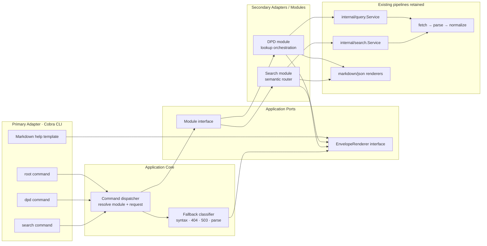
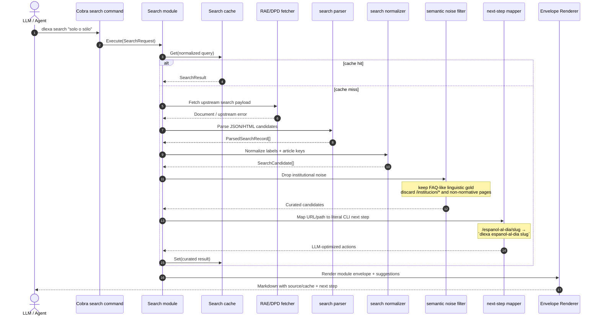

# Design: dlexa v2 Cobra Migration

## Technical Approach

Replace the `flag`-driven monolith in `internal/app` with a Cobra command tree whose handlers call module ports, then pass module outcomes through a single Envelope Renderer. This preserves the repo’s thin-entrypoint/composition-root style while aligning runtime behavior with `docs/architecture_v2_oraculo.md`: Markdown-first envelopes, semantic search as an intelligent gateway, and explicit agent-facing fallback errors.

## Architecture Decisions

| Decision | Choice | Alternatives considered | Rationale |
|---|---|---|---|
| Command surface | `cmd/dlexa/root.go`, `dpd.go`, `search.go` over Cobra | keep `flag`; one giant Cobra file | Makes subcommands explicit, enables Markdown help templates, and keeps `cmd/` thin. |
| Domain boundary | Introduce `internal/modules/dpd` and `internal/modules/search` implementing one shared `Module` contract | keep direct `query.Searcher` / `search.Searcher` wiring | Creates a stable application port for future modules (`espanol-al-dia`, DLE) without leaking Cobra into domain code. |
| Rendering boundary | Central `EnvelopeRenderer` wraps Markdown/help/fallbacks; JSON bypasses envelope body mutation | duplicate rendering inside each module | Enforces one universal envelope and one fallback ladder, minimizing drift and token waste. |

## Command Tree

`dlexa <query>` → default DPD lookup  
`dlexa dpd <query>` → explicit DPD lookup  
`dlexa search <query>` → semantic router  
`dlexa --help` / `dlexa <cmd> --help` → Markdown help with copiable examples

## Data Flow

```mermaid
stateDiagram-v2
    [*] --> CommandReceived
    CommandReceived --> SyntaxError: Cobra arg/command validation fails
    CommandReceived --> ExecuteModule: command shape valid
    ExecuteModule --> NotFound: module returns structured miss / 404
    ExecuteModule --> Upstream503: upstream unavailable / challenge / 5xx
    ExecuteModule --> ParseError: fetch ok, parse/normalize contract broken
    ExecuteModule --> Success: result rendered

    SyntaxError: Tell agent command is wrong
    NotFound: Tell agent item not here
    Upstream503: Tell agent DO NOT retry
    ParseError: Tell agent parser broke; notify developer

    SyntaxError --> [*]: EnvelopeRenderer.SyntaxFallback()
    NotFound --> [*]: EnvelopeRenderer.NotFoundFallback()
    Upstream503 --> [*]: EnvelopeRenderer.UpstreamFallback()
    ParseError --> [*]: EnvelopeRenderer.ParseFallback()
    Success --> [*]: EnvelopeRenderer.SuccessEnvelope()
```







## File Changes

| File | Action | Description |
|---|---|---|
| `cmd/dlexa/main.go` | Modify | Boot Cobra root instead of `app.App.Run`. |
| `cmd/dlexa/root.go` | Create | Global flags, Markdown help, default DPD execution path. |
| `cmd/dlexa/dpd.go` | Create | Explicit DPD subcommand bound to DPD module. |
| `cmd/dlexa/search.go` | Create | Semantic router subcommand bound to Search module. |
| `internal/app/wiring.go` | Modify | Compose modules, renderer, and Cobra dependencies. |
| `internal/app/app.go` | Delete/trim | Remove `flag` parsing and legacy command routing. |
| `internal/modules/dpd/*.go` | Create | Adapter over `query.Looker` + existing renderers. |
| `internal/modules/search/*.go` | Create | Adapter over `search.Searcher` + semantic filtering/next-step mapping. |
| `internal/render/envelope.go` | Create | Universal Markdown envelope and fallback ladder. |
| `internal/model/*.go` | Modify | Add module response metadata/fallback classification types if needed. |

## Interfaces / Contracts

```go
package render

type EnvelopeRenderer interface {
    RenderSuccess(ctx context.Context, env Envelope, body []byte) ([]byte, error)
    RenderHelp(ctx context.Context, help HelpEnvelope) ([]byte, error)
    RenderFallback(ctx context.Context, fb FallbackEnvelope) ([]byte, error)
}
```

```go
package modules

type Module interface {
    Name() string
    Command() string
    Execute(ctx context.Context, req Request) (Response, error)
}

type Response struct {
    Title      string
    Source     string
    CacheState string
    Format     string
    Body       []byte
    Fallback   *FallbackEnvelope
}
```

## Testing Strategy

| Layer | What to Test | Approach |
|---|---|---|
| Unit | Cobra arg validation, next-step mapping, fallback classification | table tests in `cmd/dlexa` and `internal/modules/*` |
| Integration | DPD/search module wiring with existing services and envelope output | extend `internal/app/app_test.go`-style fake CLI tests |
| Integration | Search router noise filtering and URL→command mapping | fixture-driven tests around `internal/modules/search` |
| Regression | JSON output remains stable for agents using `--format json` | compare serialized payloads against current contracts |

## Migration / Rollout

No data migration required. Roll out in one phase behind the new Cobra surface while preserving `dlexa <query>` as the default DPD path and `--format json` compatibility.

## Open Questions

- [ ] Should `doctor` remain a root flag or become `dlexa doctor` for full Cobra consistency?
- [ ] Should search heuristics ship with only DPD/RAE rules now, or with extension points for future Fundéu/DLE providers?
