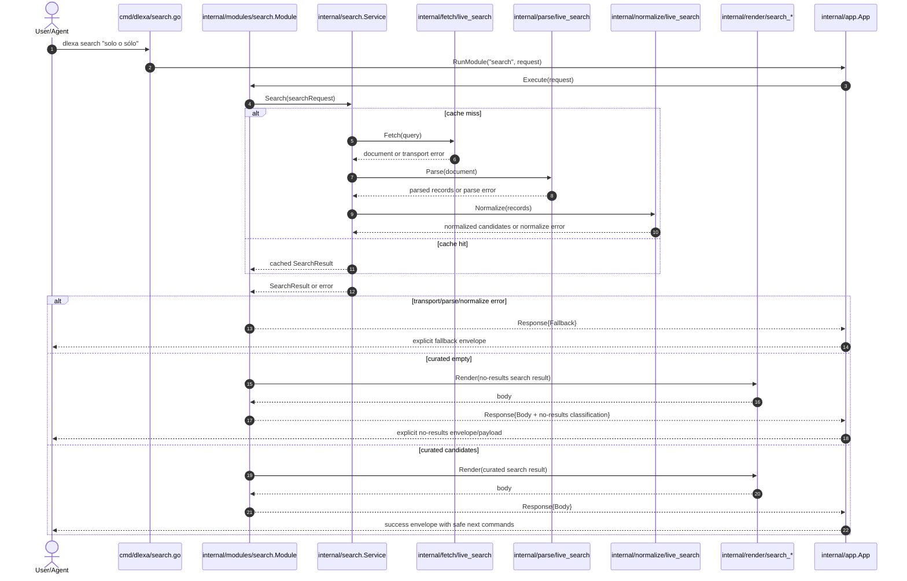
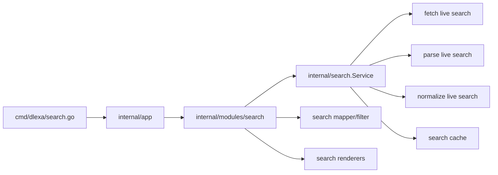

# Design: Live Semantic Search Gateway

## Technical Approach

Retarget `dlexa search <query>` from the current DPD `/srv/keys` pipeline to a live RAE search pipeline while keeping the existing layering intact:

- `cmd/dlexa/search.go` stays a thin Cobra adapter.
- `internal/app/wiring.go` swaps the concrete search fetch/parse/normalize adapters.
- `internal/search.Service` remains the fetch → parse → normalize → cache orchestrator.
- `internal/modules/search` remains the gateway layer that curates candidates, maps URLs into safe literal commands, and classifies final outcomes as success, no-results, or fallback.

This preserves the repo’s query-first architecture, keeps root invocation defaulting to DPD, and avoids adding new destination Cobra subcommands in this change.

## Architecture Decisions

| Decision | Choice | Alternatives considered | Rationale |
|---|---|---|---|
| Search orchestrator | Keep `internal/search.Service` as the runtime orchestrator | Move orchestration into `internal/modules/search` | The service already owns cache-aside fetch/parse/normalize flow. Keeping that responsibility there preserves explicit boundaries and lets the module stay focused on gateway semantics rather than transport plumbing. |
| Gateway semantics boundary | Keep filtering, URL compression, and no-results classification in `internal/modules/search` | Push filtering/mapping into parser or normalizer | These behaviors are CLI/gateway semantics, not raw-source semantics. They depend on product rules such as safe command suggestions and deferred-module guidance. |
| Upstream evolution path | Replace DPD-search adapters in wiring with live RAE-search-specific adapters behind the same service contracts | Special-case live search inside existing DPD search adapters | Swapping adapters at the composition root changes runtime behavior without breaking `Searcher`, parser, normalizer, renderer, or module contracts. |
| No-results vs failures | Represent “no curated candidates” as an explicit no-results module outcome, distinct from transport/parse fallbacks | Keep turning empty curated results into generic `NotFoundFallback` | Specs require successful-but-empty search to be distinct from failures. The module should classify empty curated output explicitly, while errors still map through the fallback ladder. |
| Safe next-step commands | Keep literal suggestions for mapped surfaces even when destination commands do not exist; mark unknown URLs with a safe search fallback | Suppress unmapped results or invent unsupported syntax | The gateway’s job is safe guidance. Suggestions like `dlexa espanol-al-dia <slug>` are valid as guidance, not as proof the subcommand exists today. |
| CLI surface | Preserve current command tree: root default-to-DPD, `dpd`, `search` only | Add `espanol-al-dia`, `noticia`, `duda-linguistica` now | The proposal explicitly forbids expanding the Cobra tree in this change. |

## Command Tree / CLI Surface Impact

Public Cobra surface after this change:

- `dlexa <query>` → default DPD lookup
- `dlexa dpd <query>` → explicit DPD lookup
- `dlexa search <query>` → live semantic search gateway

No new destination Cobra subcommands are added. `cmd/dlexa/search.go` remains thin and only forwards the request to module `search`.

## Boundary Changes and Dependency Direction

Dependency direction remains:

`cmd/dlexa` → `internal/app` → `internal/modules/search` → `internal/search` → `internal/fetch|parse|normalize|cache`

Boundary changes:

- `internal/app/wiring.go` stops composing search with `NewDPDSearchFetcher`, `NewDPDSearchParser`, and `NewDPDSearchNormalizer`.
- New live-search adapters are introduced under `internal/fetch`, `internal/parse`, and `internal/normalize`.
- `internal/search.Service` contract stays stable.
- `internal/modules/search` expands its response classification so successful empty curation is not mistaken for upstream failure.

That keeps Cobra out of domain logic and keeps source-shape concerns below the module boundary.

## Data Flow / Runtime Flow

1. Cobra receives `dlexa search <query>`.
2. `cmd/dlexa/search.go` forwards a `modules.Request` to `runtime.RunModule(..., "search", ...)`.
3. `internal/modules/search.Module.Execute` builds `model.SearchRequest`.
4. `internal/search.Service.Search` checks cache, then uses live-search fetcher, parser, and normalizer.
5. The module curates normalized candidates:
   - drop known noise (`/institucion/*`, etc.),
   - rescue approved linguistic `/noticia/*` cases,
   - enrich title/snippet/classification,
   - map known URLs to literal `dlexa ...` suggestions,
   - keep unknown URLs with safe fallback guidance.
6. The module classifies the result:
   - transport/parse/normalize error → fallback from error,
   - zero curated candidates after successful search → explicit no-results response,
   - otherwise render success payload.
7. `internal/app.App` wraps success or fallback with the shared envelope renderer.

## Mermaid Sequence Diagram for Live Search Execution

## Mermaid Flow / Component Diagram

## File Changes

| File | Action | Description |
|---|---|---|
| `openspec/changes/live-semantic-search-gateway/design.md` | Create | Technical design for this change. |
| `internal/app/wiring.go` | Modify | Rewire search from DPD `/srv/keys` adapters to live RAE search adapters. |
| `internal/search/service.go` | Modify minimally | Keep orchestration contract; only adjust comments/types if needed for provider-neutral wording. |
| `internal/fetch/*live*search*.go` | Create | Live upstream RAE search fetcher with typed transport failures. |
| `internal/parse/*live*search*.go` | Create | Parser for live search result payload/HTML. |
| `internal/normalize/*live*search*.go` | Create | Provider-specific normalization into `model.SearchCandidate`. |
| `internal/modules/search/module.go` | Modify | Distinguish explicit no-results from failures; keep curation/mapping here. |
| `internal/modules/search/filter.go` | Modify | Expand keep/drop/rescue rules for live results. |
| `internal/modules/search/mapper.go` | Modify minimally | Preserve known literal command mapping and safe unknown fallback. |
| `internal/render/search_markdown.go` | Modify | Render mapped suggestions, unmapped visible results, and explicit no-results messaging. |
| `internal/render/search_json.go` | Modify if needed | Preserve structured outcome fields for agents. |
| `internal/modules/search/module_test.go` | Modify | Cover no-results vs failure distinction and safe suggestion behavior. |
| `internal/search/service_test.go` | Modify/Add | Cover live adapter orchestration and cache behavior. |
| `internal/fetch/*`, `internal/parse/*`, `internal/normalize/*_test.go` | Create | Fixture-driven tests for live search extraction and normalization drift. |

## Testing Strategy

| Layer | What to Test | Approach |
|---|---|---|
| Unit | URL mapping, keep/drop/rescue rules, no-results classification | Table tests in `internal/modules/search` |
| Unit | Live fetch/parse/normalize adapters | Fixture-driven tests per package |
| Integration | `search` module + `internal/search.Service` wiring | Package tests with stubs/fakes, no build step |
| Regression | Root still defaults to DPD; `search` remains explicit gateway | CLI/runtime tests around `cmd/dlexa` and `internal/app` |
| Regression | JSON contract stays safe for agents | Snapshot/assert structured JSON fields |

## Rollout / Migration Notes

No data migration is required. Rollout is a single wiring change: the `search` runtime switches to live RAE search while the root default-to-DPD path remains unchanged. If instability appears, rollback is safe by restoring the previous search wiring in `internal/app/wiring.go`.

## Open Questions or Follow-ups

- [ ] Should explicit no-results be represented as a dedicated search outcome field in `model.SearchResult`, or only through module/renderer conventions?
- [ ] How many additional institutional rescue cases beyond FAQ-like `/noticia/*` should be codified now versus deferred to later changes?
- [ ] Should `internal/search.Service` comments/types be renamed from DPD-centric wording as part of this change, or left for a separate cleanup change?
